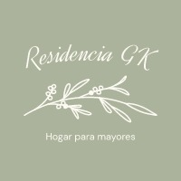

## ★ Proyecto: Geriátrico GK
#### Este proyecto forma parte del curso Desarrollo Web, dictado por Coderhouse.

##### - Profesor: José Alvarez
##### - Tutor: Andrés Pata

Website:
[Mira acá mi página](https://geriatrico-gk.netlify.app/)

⋆ Diseño responsivo:
  - Smartphone
  - Tablet

⋆ Construido con:
  - HTML
  - CSS
  - SASS
  - Deply en NETLIFY

⋆ Recursos:
  - ✔ Fuente: https://fonts.google.com/
  - 🎨 Paleta de Colores: https://coolors.co/
  - 📷 Imagenes: https://ar.pinterest.com/
  